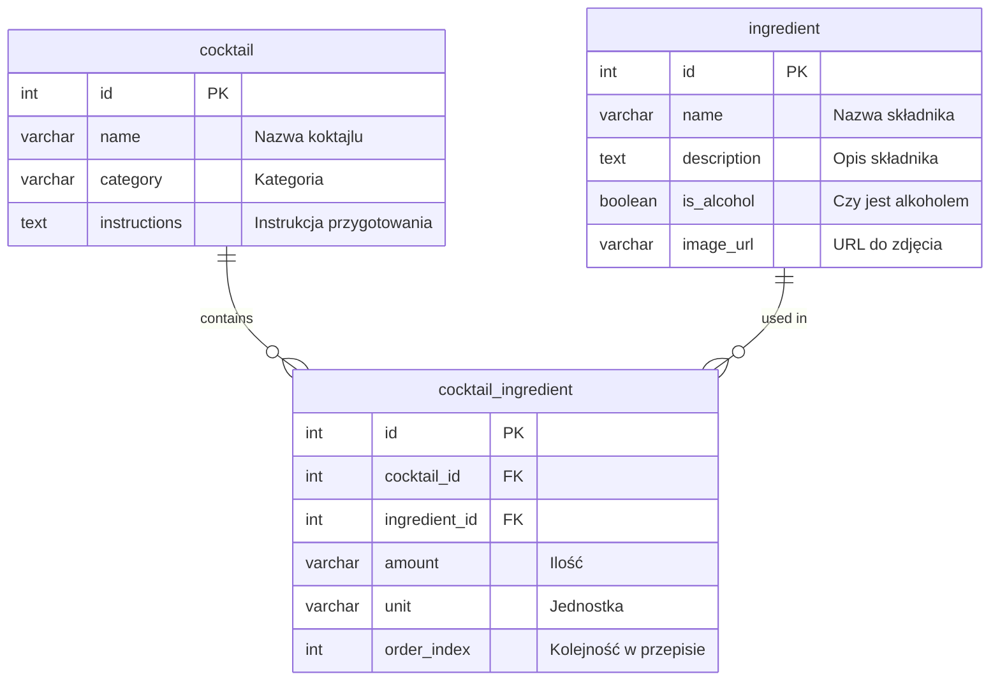

<p align="center">
  <a href="http://nestjs.com/" target="blank"></a>
</p>

[circleci-image]: https://img.shields.io/circleci/build/github/nestjs/nest/master?token=abc123def456
[circleci-url]: https://circleci.com/gh/nestjs/nest

## Project setup

```bash
$ pnpm install
```

## Compile and run the project

```bash
# development
$ pnpm run start

# watch mode
$ pnpm run start:dev

# production mode
$ pnpm run start:prod
```

## Run tests

```bash
# unit tests
$ pnpm run test

# e2e tests
$ pnpm run test:e2e

# test coverage
$ pnpm run test:cov
```

## Backend task

**Ze względu na to, że w naszych projektach pracujemy głównie we frameworkach JavaScriptu akceptujemy zadania tylko w TypeScript/JavaScript. W kole używamy głównie [NestJS](https://docs.nestjs.com/), ale nie przejmuj się jeśli go nie znasz, nauczysz się go z nami w pierwszych tygodniach, chociaż zachęcamy do podjęcia rękawic i spróbowania już podczas rekrutacji😉**

### Opis zadania

Twoim zadaniem jest przygotowanie REST API do zarządzania koktajlami i jego składnikami. Każdy koktajl posiada składniki z których się go robi. Z pomocą aplikacji mamy być w stanie utworzyć, edytować, wyświetlić i usunąć koktajle i składniki. W skrócie powinniśmy zaimplementować pełnego CRUDa koktajli i składników.

### Koktajl

Każdy koktajl zawiera minimum:

- id
- nazwę
- kategorię
- instrukcję
- składniki wraz z ilościami potrzebnymi do utworzenia

### Składnik

Każdy składnik posiada minimum:

- id
- nazwę
- opis
- czy jest alkoholem
- zdjęcie

### Nice to have

- screen projektu bazy danych
- zastosowanie zasad REST
- testy automatyczne
- dokumentacja
- wsparcie dla filtrowania i sortowania endpointów (filtrowanie zasobów na podstawie określonych parametrów (np. koktajle zawierające określony składnik, koktajle bez alkoholu), sortowanie wyników według różnych pól (np. alfabetycznie po nazwie, według daty dodania, według kategorii koktajli).)

## Projekt bazy danych


